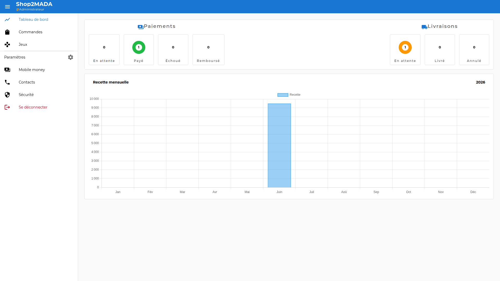
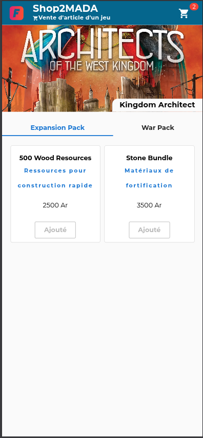
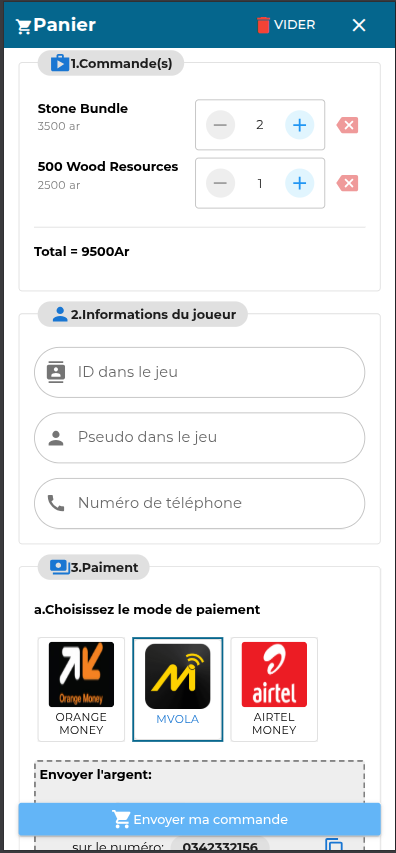

# 📦 SHOP2MADA

> E-commerce pour la vente d'article d'un jeu


---

## 📸 Aperçu

| Dashboard                              | Offer                                  | Shopping_cart                          | Home                              |
| -------------------------------------- | -------------------------------------- | -------------------------------------- | --------------------------------- |
|  |  |  |  |

---

## 🧱 Stack technique

| Couche          | Technologie            |
| --------------- | ---------------------- |
| Backend         | NestJS (express)       |
| Frontend        | Vue 3 (Quasar)         |
| Base de données | MongoDB                |
| Auth            | JWT, bcrypt            |
| DevOps          | Docker, Docker Compose |

---

## 📁 Structure du projet

```
shop2mada/
├── backend/
│   ├── src/
│   │   │__modules
│   │        └── seed
│   ├── Dockerfile
│   └── .env.example
├── frontends/
│   ├── admin/
│   │   ├── src/
│   │   └── Dockerfile
│   └── client/
│       ├── src/
│       └── Dockerfile
├── docker-compose.yml
└── README.md
```

---

## 🚀 Installation & Lancement

### Prérequis

- Node.js 20+
- Git
- [Docker](https://www.docker.com/) & Docker Compose

### 1. Cloner le projet

```bash
git clone https://github.com/Delon-HUB/shop2mada.git
cd shop2mada
```

### 2. Configurer les variables d'environnement

```bash
cp backend/.env.sample  backend/.env
# Editer le fichier .env avec tes valeurs
```

### 3. Lancer avec Docker

```bash
docker compose up -d
```

### 4. Peupler la base de données

```bash
docker compose exec backend npm run seed
```

---

### 5. Accéder à l'application

| Service | URL                       |
| ------- | ------------------------- |
| Backend | http://localhost:5000     |
| Admin   | http://localhost:8080     |
| Client  | http://localhost:8081     |
| MongoDB | mongodb://localhost:27017 |

---

## 🐳 Commandes Docker utiles

```bash
# Lancer les services
docker compose up -d

# Voir les logs
docker compose logs -f

# Logs d'un service spécifique
docker compose logs -f backend

# Arrêter
docker compose down

# Rebuild + relancer
docker compose up -d --build

# Entrer dans un container
docker exec -it backend sh
```

---

## 🛠️ Développement local (sans Docker)

```bash
# Backend
cd backend
npm install
npm run seed
npm run dev

# Frontend admin
cd frontends/admin
npm install
npm run dev

# Frontend client
cd frontends/client
npm install
npm run dev
```

---

## 👤 Auteur

**Nicolas Delon**

- GitHub : [@Delon-HUB](https://github.com/Delon-HUB)

---
